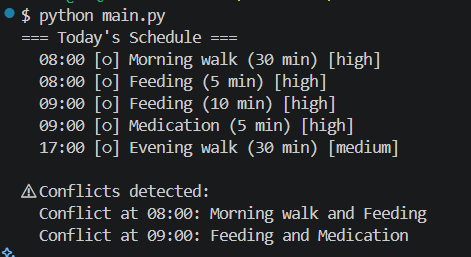
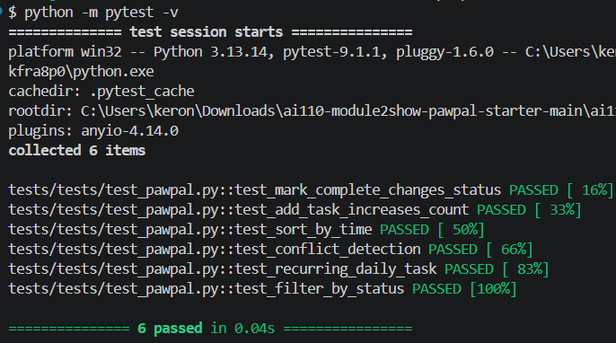
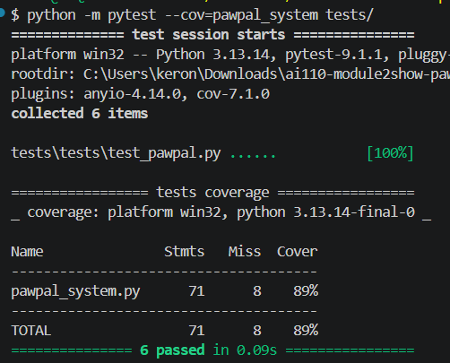

# PawPal+ (Module 2 Project)

You are building **PawPal+**, a Streamlit app that helps a pet owner plan care tasks for their pet.

## Scenario

A busy pet owner needs help staying consistent with pet care. They want an assistant that can:

- Track pet care tasks (walks, feeding, meds, enrichment, grooming, etc.)
- Consider constraints (time available, priority, owner preferences)
- Produce a daily plan and explain why it chose that plan

Your job is to design the system first (UML), then implement the logic in Python, then connect it to the Streamlit UI.

## What you will build

Your final app should:

- Let a user enter basic owner + pet info
- Let a user add/edit tasks (duration + priority at minimum)
- Generate a daily schedule/plan based on constraints and priorities
- Display the plan clearly (and ideally explain the reasoning)
- Include tests for the most important scheduling behaviors

## Getting started

### Setup

```bash
python -m venv .venv
source .venv/bin/activate  # Windows: .venv\Scripts\activate
pip install -r requirements.txt
```

### Suggested workflow

1. Read the scenario carefully and identify requirements and edge cases.
2. Draft a UML diagram (classes, attributes, methods, relationships).
3. Convert UML into Python class stubs (no logic yet).
4. Implement scheduling logic in small increments.
5. Add tests to verify key behaviors.
6. Connect your logic to the Streamlit UI in `app.py`.
7. Refine UML so it matches what you actually built.

## 🖥️ Sample Output

Paste a sample of your app's CLI or Streamlit output here so a reader can see what a generated plan looks like:

```
# e.g.:
# Daily plan for Biscuit (Golden Retriever):
#   08:00 — Morning walk (30 min) [priority: high]
#   09:00 — Feeding (10 min) [priority: high]
#   ...
```
    

## 🧪 Testing PawPal+

```bash
# Run the full test suite:
pytest

    

# Run with coverage:
pytest --cov
```
    

Sample test output:

```
# Paste your pytest output here
```
    plugins: anyio-4.14.0
    collected 6 items                                 

    tests/tests/test_pawpal.py::test_mark_complete_changes_status PASSED [ 16%]
    tests/tests/test_pawpal.py::test_add_task_increases_count PASSED [ 33%]
    tests/tests/test_pawpal.py::test_sort_by_time PASSED [ 50%]
    tests/tests/test_pawpal.py::test_conflict_detection PASSED [ 66%]
    tests/tests/test_pawpal.py::test_recurring_daily_task PASSED [ 83%]
    tests/tests/test_pawpal.py::test_filter_by_status PASSED [100%]

    =============== 6 passed in 0.04s ================


    plugins: anyio-4.14.0, cov-7.1.0
    collected 6 items                                 

    tests\tests\test_pawpal.py ......           [100%]

    ================= tests coverage =================
    _ coverage: platform win32, python 3.13.14-final-0 _

    Name               Stmts   Miss  Cover
    --------------------------------------
    pawpal_system.py      71      8    89%
    --------------------------------------
    TOTAL                 71      8    89%
    =============== 6 passed in 0.09s ================

## 📐 Smarter Scheduling

> Fill in once you've implemented scheduling logic.

| Feature           | Method(s)                        | Notes                              |
| ----------------- | -------------------------------- | ---------------------------------- |
| Task sorting      | Scheduler.sort_by_time()         | Sorts by HH:MM string              |
| Filtering         | Scheduler.filter_by_status()     | Filters by completion status       |
| Conflict handling | Scheduler.detect_conflicts()     | Warns on exact time matches        |
| Recurring tasks   | Task.mark_complete()             | Creates next-day task if daily     |

## 📸 Demo Walkthrough

Describe your app in numbered steps so a reader can follow along without watching a video:

1. User opens the app and enters owner name "Jordan"
2. User adds a pet: "Biscuit" (dog)
3. User adds tasks: Morning walk at 08:00 (high priority), Feeding at 09:00 (high), Evening walk at 17:00 (medium)
4. User clicks "Generate Schedule" — tasks appear sorted by time in a table
5. User adds a second task also at 08:00 — a conflict warning appears in orange
6. User marks Morning walk complete — a new daily task is auto-scheduled for tomorrow

**Screenshot or video** *(optional)*: <!-- Insert a screenshot or link to a demo video here -->
